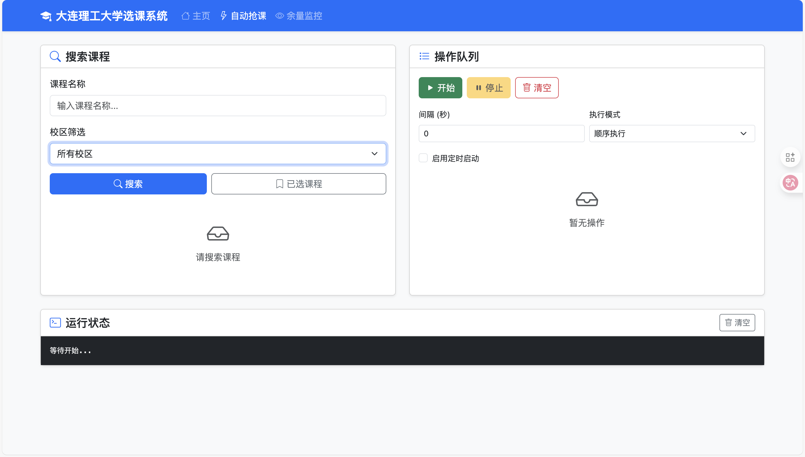

# 大连理工大学选课助手

## 要饭

好用的话可以赞赏一下喵

## 介绍

基于 Flask 的 Web 选课工具，提供可视化界面进行课程搜索、选课、退课等操作。

> 本工具仅在正选阶段测试过，不保证适用于预选阶段。

## 功能

- 统一身份认证登录
- 课程搜索（支持按校区筛选）
- 一键选课/退课
- 查看已选课程
- 查看选课人数
- 课程缓存刷新

## 安装

从Release里下载
启动后会自动打开浏览器访问登录页面。

## 使用说明

1. 在登录页面输入统一身份认证的用户名和密码
2. 选择选课轮次后登录
3. 在主界面搜索课程，点击"选课"按钮即可

## 注意事项

- 课程数据会缓存到 `ilist.json`，如需更新可点击"刷新课程缓存"
- 本工具仅供学习交流使用
