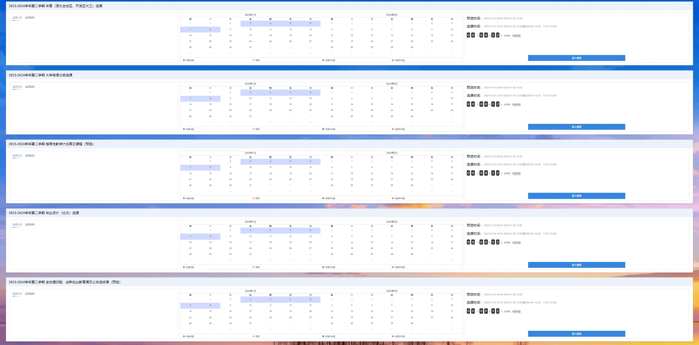

# 大连理工大学自动抢课脚本
## 介绍
本脚本仅在正选阶段测试过，不适用于预选阶段
## 配置
### config.ini
需要在项目目录中配置config.ini
```
[dlut_sso]
userid = 用户名
password = 密码
[turn]
number = 0 #选课界面会有多个轮次，这里填写你要选的轮次
```
关于turn number解释：

如图所示，选课界面有多个轮次，上图第一个代表0，第二个代表1，以此类推

## 运行
### 获取class_id
将脚本中的`print(search_class("大学物理",ilist))`，中大学物理改为你的课程名字，从而获取id
### 运行抢课脚本
在main.py中修改
```
class_id = 6666 #请将此替换为你要选的class_id
```
然后运行main.py即可

**注：请在抢课正式开始前就完成获取class_id的操作，并运行main.py，以免耽误抢课时间**
