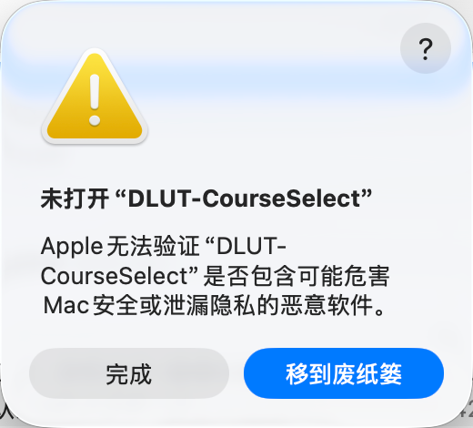

# 大连理工大学选课助手

## macOS 必看

从 Release 下载的 macOS 程序没有 Apple 签名，双击会出现下面这个提示，**程序并没有损坏**，也不要点「移到废纸篓」。



在终端里对解压出来的可执行文件执行一次（把路径换成你自己的）：

```bash
xattr -cr ~/Downloads/DLUT-CourseSelect
```

之后就可以正常打开了。

## 说明

数据存在 `~/.dlut-course-select/`，为保证抢课速度会缓存一部分信息，**缓存不会自动刷新**：

| 文件 | 内容 | 怎么刷新 |
| --- | --- | --- |
| `ilist.json` | 课程列表 | 登录后主页导航栏「刷新缓存」 |
| `turns_cache.json` | 选课轮次 | 登录页轮次旁的「刷新」 |
| `stu_id_cache.json` | 学生 ID | 没有界面入口，一般不用动 |

课程列表是全局一份，**不按轮次分开存**。换了选课轮次务必点一次「刷新缓存」，否则搜索到的还是上一轮的课。

## 介绍

基于 Flask 的本地 Web 选课工具，启动后自动打开浏览器，可以搜索课程、选课、退课，以及后台自动抢课 / 余量监控。

> 本工具仅在正选阶段测试过，不保证适用于预选阶段。


## 功能

- 统一身份认证登录，登录后选择选课轮次
- 课程搜索：名称、代码、教学班、教师、校区、课程类型 / 性质、方案内行政班、必修/选修、仅显示有余量
- 一键选课 / 退课；一门课有多个选课组时先选组
- 查看已选课程和选课人数
- 课程缓存刷新
- 自动抢课：操作队列、顺序 / 并发（最多 20 线程）、定时启动
- 余量监控：发现余量可自动选课，支持选课前先退一门已选课
- 抢课和监控任务跑在程序后台，切换页面不中断

## 安装

从 [Release](https://github.com/songhahaha66/dlut_auto_select_courses/releases) 下载：

- Windows：`DLUT-CourseSelect.exe`
- macOS：`DLUT-CourseSelect-macOS.zip`（先看上面的「macOS 必看」）

没有 Linux 打包。启动后会自动打开浏览器访问登录页（默认 `http://127.0.0.1:5001/login`，5001–5010 自动找空闲端口）。

从源码运行需要 Python 3.11+：

```bash
pip install -r requirements.txt
python app.py
```

或用 uv：

```bash
uv run python app.py
```

## 使用说明

1. 登录页输入统一身份认证的学号 / 工号和密码，点下一步
2. 选择选课轮次后登录（轮次列表过期了点旁边的「刷新」）
3. 三个页面：
   - **主页**：搜索、选课、退课、看已选课程；换轮次后点「刷新缓存」
   - **自动抢课**：把选课 / 退课加进队列，设间隔、顺序或并发、可选定时启动，点「开始」
   - **余量监控**：把课加入监控列表，可勾选发现余量自动选课，以及自动选课前先退课

## 后台任务说明

自动抢课和余量监控跑在程序后台，不依赖浏览器页面。这带来几点需要注意：

- **切换页面或刷新不会中断任务**，队列、监控列表和运行日志都会原样恢复
- **关闭浏览器标签页不等于停止**，只有点击「停止」按钮或退出程序才会真正结束任务
- 队列是全局共享的，开多个标签页看到的是同一个任务，不是各自独立的
- 并发线程数会完整生效（以前受浏览器同域名连接数限制，填再高实际也跑不满），**抢课高峰期请谨慎调高线程数和缩短间隔**，以免触发教务系统风控
- 退出登录或重新登录都会自动停止并清空所有后台任务

## 注意事项

- 本工具仅供学习交流使用

## 要饭


好用的话可以赞赏一下喵
