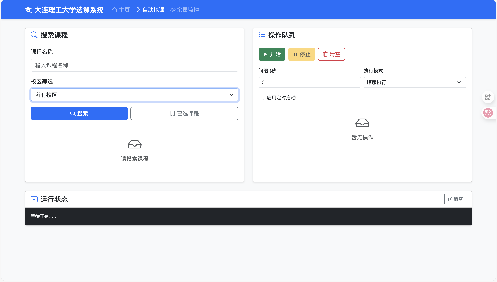

# 大连理工大学选课助手

## 说明

数据存储于`~/.dlut_course_helper/`目录下，为保证抢课速度，有一些数据被缓存。注意现在**缓存不会自动刷新**，选课轮次，课程数据这两个信息必要时需要手动点击按钮刷新。

## 介绍

基于 Flask 的 Web 选课工具，提供可视化界面进行课程搜索、选课、退课等操作。

> 本工具仅在正选阶段测试过，不保证适用于预选阶段。

## 功能

- 统一身份认证登录
- 课程搜索（支持按校区筛选）
- 一键选课/退课
- 查看已选课程
- 查看选课人数
- 课程缓存刷新
- 自动抢课与余量监控（任务在后台运行，切换页面不中断）

## 安装

从Release里下载
启动后会自动打开浏览器访问登录页面。

## 使用说明

1. 在登录页面输入统一身份认证的用户名和密码
2. 选择选课轮次后登录
3. 在主界面搜索课程，点击"选课"按钮即可

## 后台任务说明

自动抢课和余量监控跑在程序后台，不依赖浏览器页面。这带来几点需要注意：

- **切换页面或刷新不会中断任务**，队列、监控列表和运行日志都会原样恢复
- **关闭浏览器标签页不等于停止**，只有点击"停止"按钮或退出程序才会真正结束任务
- 队列是全局共享的，开多个标签页看到的是同一个任务，不是各自独立的
- 并发线程数现在会完整生效（以前受浏览器同域名连接数限制，填再高实际也跑不满），**抢课高峰期请谨慎调高线程数和缩短间隔**，以免触发教务系统风控
- 退出登录会自动停止并清空所有后台任务

## 注意事项

- 课程数据会缓存到 `ilist.json`，如需更新可点击"刷新课程缓存"
- 本工具仅供学习交流使用

## 要饭

好用的话可以赞赏一下喵